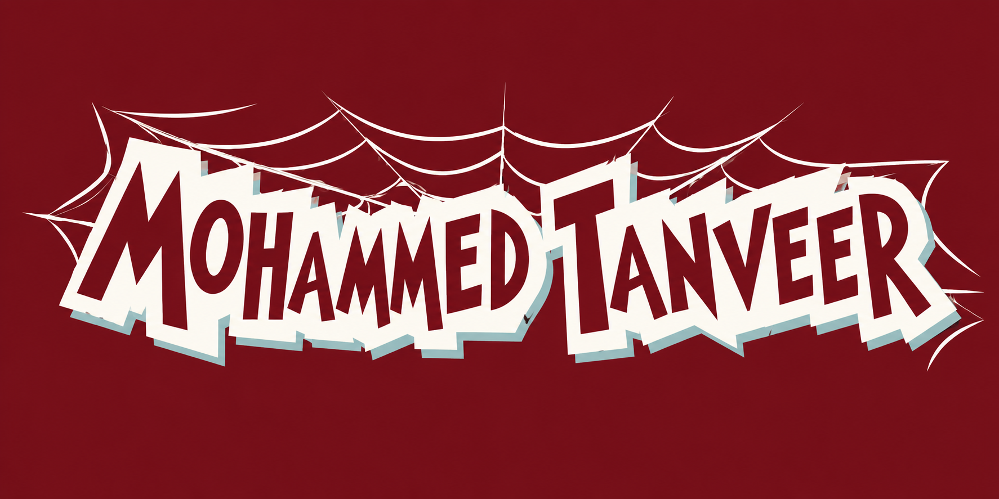

  

 

<table>
<tr>

<td width="35%" align="center">

<h2>Mohammed Tanveer</h2>

<b>Software Developer</b>

📍 India

🎓 B.Tech AI & DS

 

</td>

<td width="65%">

<h2>🔗 Who Am I?</h2>

I am a <b>Software Developer</b> passionate about building
modern web applications, AI-powered solutions, and
creative digital experiences.

I enjoy turning ideas into practical products and
constantly improving my skills through hands-on projects.

Currently, I'm focused on strengthening my fundamentals,
building complete projects from planning and interface
design to implementation and delivery.

My goal is to continuously learn, build meaningful
projects, and grow as a versatile software developer.

</td>

</tr>
</table>

 

<h2 align="center">🔗 You Can Click Here</h2>

 

<table>
<tr>

<td width="70%">

<h3>⚠️ Caution</h3>

Code is never finished, it only gets better.

What you see here is built with practice,
curiosity, and persistence.

</td>

<td width="30%" align="center">

 

▶ Click to view animation

</td>

</tr>
</table>

 

<h2 align="center">🛠️ Tech Stack</h2>

 

<h2 align="center">📊 GitHub Stats</h2>

 

<h2 align="center">💻 Most Used Languages</h2>

 

<h2 align="center">🚀 Featured Projects</h2>

<table>
<tr>

<td width="50%" align="center">

<h3>🤖 AI Resume Shortlister</h3>

AI-powered resume screening system using
NLP and Machine Learning.

<a href="YOUR_PROJECT_LINK">
View Project →
</a>

</td>

<td width="50%" align="center">

<h3>🏢 ERP Platform</h3>

Full-stack enterprise management platform
with multiple modules.

<a href="YOUR_PROJECT_LINK">
View Project →
</a>

</td>

</tr>

<tr>

<td width="50%" align="center">

<h3>📖 Story Seeds</h3>

Interactive storytelling platform designed
for creative learning and expression.

<a href="YOUR_PROJECT_LINK">
View Project →
</a>

</td>

<td width="50%" align="center">

<h3>☕ AI Coffee Dispenser</h3>

Smart AI-powered coffee dispensing
system.

<a href="YOUR_PROJECT_LINK">
View Project →
</a>

</td>

</tr>
</table>

 

<h2 align="center">🏆 Achievements</h2>

🏅 Project & Technical Events 
🎬 Short Film Achievement 
♟️ Chess Champion 
💻 Multiple Software & AI Projects

 

<h2 align="center">📈 Contribution Activity</h2>

 

<b>⚡ Building. Learning. Creating. Repeating. ⚡</b>

